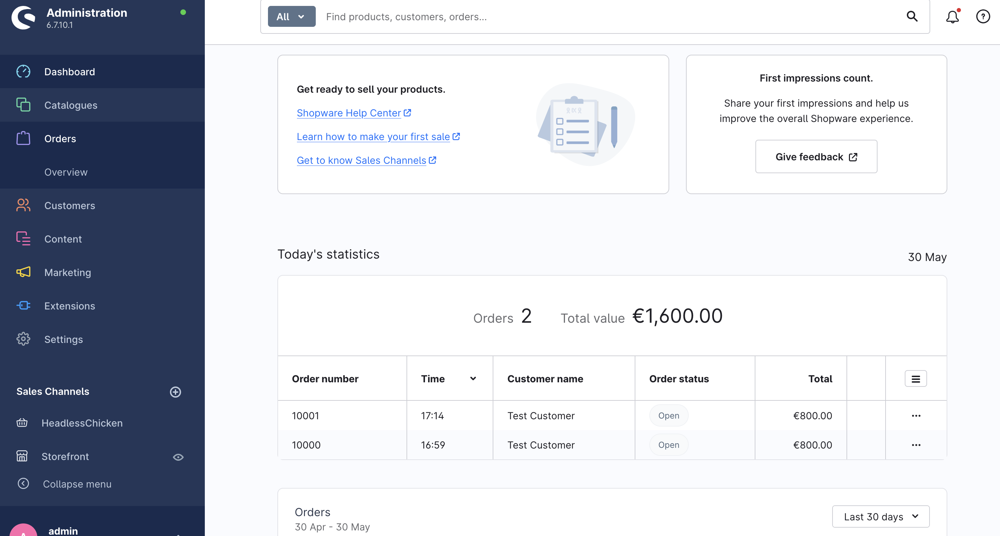

# Order Integration Plugin — Phase 1

Shopware 6 plugin that exposes a domain-shaped, service-to-service REST API for order management. Built as a Shopware-native plugin running inside the Shopware backend container, calling Shopware's internal services directly — no HTTP hop to the Admin API.

---

## Context & motivation

Shopware 6 ships two HTTP APIs:

| API | Purpose | Auth | Suitable for |
|---|---|---|---|
| **Store API** | Storefront-facing: catalog, cart, checkout, customer account | Sales channel access key + `sw-context-token` | Headless frontends, end users |
| **Admin API** | Full CRUD over all entities, state machine transitions | OAuth 2.0 (password grant / client credentials) | Back-office tools, low-volume integrations |

Neither is the right production traffic plane for a D2C integration with an ERP or OMS:

- The **Admin API** runs on the same PHP-FPM pool as the storefront, goes through the full Shopware DAL stack (validation, indexing, event firing, serializer) on every call, and will saturate the shop under order-volume read traffic.
- The **Store API** is designed for human-paced storefront traffic and is not appropriate for service-to-service integration load.

The solution is a **Shopware plugin** that registers its own API routes and calls Shopware's internal PHP services (`EntityRepository`, `CartService`, `StateMachineRegistry`, `OrderConverter`) directly — in-process, no HTTP overhead, same DB transaction where needed. This is orders of magnitude faster than calling the Admin API from outside and avoids competing with storefront traffic.

---

## Architecture

### Deployment topology

```
┌──────────────────────────────────────────┐
│  LXC Container: shopware-be              │
│                                          │
│  Apache 2.4 (port 80)                    │
│    └── PHP 8.4-FPM                       │
│         └── Shopware 6.7 (prod)          │
│              └── OrderIntegration Plugin │
│                   └── /api/order-integration/v1/... │
│                                          │
│  MariaDB 10.11 (localhost:3306)          │
└──────────────────────────────────────────┘
         │ Store API / Admin API (HTTP, LAN)
┌──────────────────────────────────────────┐
│  LXC Container: shopware-fe              │
│                                          │
│  Node.js 22 / Nuxt 3 (port 3000)        │
│  http://shopware-fe.lan.internal:3000    │
└──────────────────────────────────────────┘
```

The plugin lives inside the Shopware container. Its routes are served by Apache → PHP-FPM alongside the rest of Shopware. The test scripts call `http://localhost/...` because they run on the same host. External callers use `http://shopware-be.lan.internal/...`.

### Plugin location

The plugin source lives in its own git repository, symlinked into the Shopware custom plugins directory:

```
/var/www/shopware_development/     ← git repo (this repo)
/var/www/shopware/custom/plugins/OrderIntegration → /var/www/shopware_development  (symlink)
/var/www/shopware/                 ← Shopware installation (separate, not in this repo)
```

This separation keeps plugin code versioned independently of Shopware.

---

## API design decisions

### Why a plugin instead of a standalone facade

Three options were evaluated (see `docs/order-api-concept.md` and `docs/spike-order-creation.md` for the full analysis):

| Option | Description | Decision |
|---|---|---|
| **A** | Callers hit the Shopware Admin API directly | Rejected — tight coupling, no domain contract, not suitable for D2C load |
| **B** | Standalone facade service in front of the Admin API | Viable for low volume; becomes Option C over time |
| **C (Weg A, Phase 1)** | Plugin inside Shopware using internal services | **Chosen** — lowest latency, no extra hop, uses Shopware's own pricing/checkout code |

A future Phase 2 will add a read projection (Postgres/OpenSearch) fed by Shopware business events to decouple read traffic entirely from the Shopware DB.

### Route namespace

Shopware reserves `/api/integration/...` for its own integration entity. The plugin uses `/api/order-integration/v1/...` to avoid collision.

### Authentication

Two auth methods are supported, both via Shopware's OAuth2 token endpoint (`/api/oauth/token`):

**1. Password Grant (development/admin use)**
```bash
curl -X POST /api/oauth/token \
  -d '{"grant_type":"password","client_id":"administration","username":"admin","password":"...","scopes":"write"}'
```

**2. Client Credentials Grant (service-to-service, recommended)**

A dedicated Shopware Integration user (`order-integration-client`) is created with limited scope (`admin: false`). Services authenticate with their `accessKey` and `secretAccessKey`:

```bash
curl -X POST /api/oauth/token \
  -d '{"grant_type":"client_credentials","client_id":"<SHOPWARE_INTEGRATION_ACCESS_KEY>","client_secret":"<SHOPWARE_INTEGRATION_SECRET>"}'
```

The integration user credentials are stored in `.env.test` (gitignored). See `.env.test.dist` for required keys.

Plugin routes are registered in the `api` route scope — Shopware validates the Bearer token on every request. No valid token → `401 Unauthorized`.

Future phases will add mTLS at the gateway level and ACL role-based scope restrictions per integration.

### Domain status mapping

A single `status` field is exposed to callers, mapped from Shopware's `stateMachineState.technicalName`. Shopware maintains three independent state machines per order (order state, payment state, delivery state). The plugin exposes all three but normalises the primary order state into the domain model.

---

## Implemented endpoints (Phase 1)

### `GET /api/order-integration/v1/orders`

Lists orders with key fields. Loads associations: `lineItems`, `deliveries`, `transactions`, `addresses`, `stateMachineState`, `currency`.

**Response:**
```json
{
  "items": [
    {
      "id": "019e79d3be9272308522b3aea51a4adc",
      "orderNumber": "10000",
      "status": "open",
      "total": {
        "amount": 800,
        "currency": "EUR"
      },
      "createdAt": "2026-05-30T16:59:40+00:00",
      "updatedAt": null
    }
  ],
  "page": {
    "total": 1,
    "limit": 50
  }
}
```



**Query parameters:**
- `limit` (int, default 50, max 200)

---

## Infrastructure requirements

| Component | Version | Notes |
|---|---|---|
| Debian | Trixie (13) | LXC container on Proxmox |
| PHP | 8.4 | Default in Trixie |
| Apache | 2.4 | `mod_rewrite`, `mod_headers` enabled |
| MariaDB | 10.11 | Default in Trixie |
| Shopware | 6.7.x | Installed at `/var/www/shopware` |
| Composer | 2.x | For plugin dependency declaration |

---

## Installation

```bash
# 1. Clone into the Shopware container
git clone git@github.com:Scotty42/shopware.git /var/www/shopware_development

# 2. Symlink into Shopware
ln -s /var/www/shopware_development /var/www/shopware/custom/plugins/OrderIntegration

# 3. Set correct ownership
chown -R www-data:www-data /var/www/shopware/var/

# 4. Register and activate plugin
cd /var/www/shopware
./bin/console plugin:refresh
./bin/console plugin:install --activate OrderIntegration
./bin/console cache:clear
```

---

## Development

### Credentials

Copy `.env.test.dist` to `.env.test` and fill in credentials. This file is gitignored and never committed.

```bash
cp .env.test.dist .env.test
```

### Run tests

```bash
# Verify the GET /v1/orders endpoint
tests/api_test.sh

# Create a test order via Store API, then re-run api_test.sh
tests/create_test_order.sh
```

### After code changes

```bash
cd /var/www/shopware
./bin/console cache:clear
```

---

## Roadmap

| Phase | Description |
|---|---|
| **1 (current)** | Plugin skeleton, `GET /v1/orders` + `GET /v1/orders/{id}`, cursor pagination, filters, RFC 9457 errors, OAuth2 password grant + client credentials, 13-test suite |
| **2** | `POST /v1/orders` via `CartService` + `OrderConverter` (Path 2 from spike), `PUT /v1/orders/{id}/status` state machine transitions |
| **3** | `PATCH /v1/orders/{id}`, `DELETE /v1/orders/{id}` (soft cancel), delivery sub-resource |
| **4** | Read projection fed by Shopware business events — decouple read traffic from Shopware DB |
| **5** | Dedicated auth (API key / mTLS), rate limiting, idempotency store, RFC 9457 error model |

---

## Reference documents

- `docs/order-api-concept.md` — full architecture analysis, Options A/B/C, ERP integration design, security model
- `docs/order-api-openapi.yaml` — OpenAPI 3.1 spec for the full target API surface
- `docs/spike-order-creation.md` — analysis of four order-creation paths in Shopware 6
