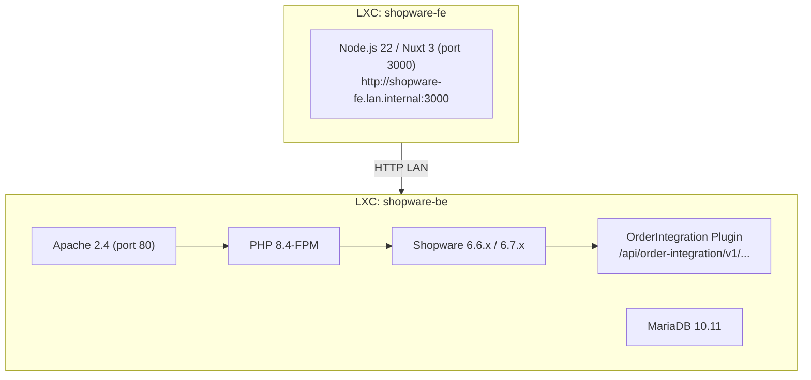
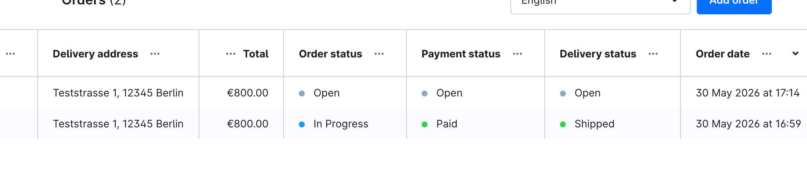

# Order Integration Plugin

Shopware 6 plugin that exposes a domain-shaped, service-to-service REST API for order management. Built as a Shopware-native plugin running inside the Shopware backend container, calling Shopware's internal PHP services directly — no HTTP hop to the Admin API.

---

## Context & motivation

Shopware 6 ships two HTTP APIs:

| API | Purpose | Auth | Suitable for |
|---|---|---|---|
| **Store API** | Storefront-facing: catalog, cart, checkout, customer account | Sales channel access key + `sw-context-token` | Headless frontends, end users |
| **Admin API** | Full CRUD over all entities, state machine transitions | OAuth 2.0 (password grant / client credentials) | Back-office tools, low-volume integrations |

Neither is the right production traffic plane for a D2C integration with an ERP or OMS:

- The **Admin API** runs on the same PHP-FPM pool as the storefront, goes through the full Shopware DAL stack on every call, and will saturate the shop under order-volume read traffic.
- The **Store API** is designed for human-paced storefront traffic and is not appropriate for service-to-service integration load.

The solution is a **Shopware plugin** that registers its own API routes and calls Shopware's internal PHP services (`EntityRepository`, `CartService`, `StateMachineRegistry`, `OrderConverter`) directly — in-process, no HTTP overhead, same DB transaction where needed.

---

## Architecture

### Deployment topology

The plugin lives inside the Shopware container. Test scripts call `http://localhost/...` because they run on the same host. External callers use `http://shopware-be.lan.internal/...`.

### Plugin location
/var/www/shopware_development/     ← git repo (this repo)
/var/www/shopware/custom/plugins/OrderIntegration → /var/www/shopware_development  (symlink)
/var/www/shopware/                 ← Shopware installation (separate, not in this repo)

### Shopware version compatibility

| Version | Status |
|---|---|
| 6.6.x LTS | Supported (production target) |
| 6.7.x | Supported (development environment) |
| 6.8.x LTS | Planned migration target |

No breaking changes were identified between 6.6.10 and 6.7.x for the services used by this plugin (`CartService`, `OrderPersister`, `OrderConverter`, `StateMachineRegistry`, `MultiFilter`).

---

## API design decisions

### Why a plugin instead of a standalone facade

Three options were evaluated (see `docs/order-api-concept.md` and `docs/spike-order-creation.md`):

| Option | Description | Decision |
|---|---|---|
| **A** | Callers hit the Shopware Admin API directly | Rejected — tight coupling, not suitable for D2C load |
| **B** | Standalone facade service in front of the Admin API | Viable for low volume; becomes Option C over time |
| **C** | Plugin inside Shopware using internal services | **Chosen** — lowest latency, no extra hop, uses Shopware's own pricing/checkout code |

### Route namespace

Shopware reserves `/api/integration/...` for its own integration entity. The plugin uses `/api/order-integration/v1/...` to avoid collision.

### Authentication

Two auth methods are supported, both via Shopware's OAuth2 token endpoint (`/api/oauth/token`):

**1. Password Grant (development/admin use)**
```bash
curl -X POST /api/oauth/token \
  -d '{"grant_type":"password","client_id":"administration","username":"admin","password":"...","scopes":"write"}'
```

**2. Client Credentials Grant (service-to-service, recommended)**

A dedicated Shopware Integration user is created with limited scope (`admin: false`). Services authenticate with their `accessKey` and `secretAccessKey`:

```bash
curl -X POST /api/oauth/token \
  -d '{"grant_type":"client_credentials","client_id":"<SHOPWARE_INTEGRATION_ACCESS_KEY>","client_secret":"<SHOPWARE_INTEGRATION_SECRET>"}'
```

Plugin routes are registered in the `api` route scope — Shopware validates the Bearer token on every request. No valid token → `401 Unauthorized`.

---

## Implemented endpoints



### Orders

| Method | Path | Description |
|---|---|---|
| `GET` | `/api/order-integration/v1/orders` | List orders (cursor pagination, filters) |
| `POST` | `/api/order-integration/v1/orders` | Create order via CartService + OrderPersister |
| `GET` | `/api/order-integration/v1/orders/{id}` | Get single order |
| `PATCH` | `/api/order-integration/v1/orders/{id}` | Update mutable fields |
| `DELETE` | `/api/order-integration/v1/orders/{id}` | Soft cancel (transitions to `cancelled`) |

### Status transitions

| Method | Path | Description |
|---|---|---|
| `PUT` | `/api/order-integration/v1/orders/{id}/status` | Order state machine (`open → in_progress → completed/cancelled`) |
| `PUT` | `/api/order-integration/v1/orders/{id}/payment-status` | Payment state machine (`open → paid → refunded` etc.) |
| `PUT` | `/api/order-integration/v1/orders/{id}/delivery-status` | Delivery state machine (`open → shipped → returned` etc.) |

### Deliveries (sub-resource)

| Method | Path | Description |
|---|---|---|
| `GET` | `/api/order-integration/v1/orders/{id}/deliveries` | List all deliveries on an order |
| `POST` | `/api/order-integration/v1/orders/{id}/deliveries` | Create additional delivery (split shipment) |
| `GET` | `/api/order-integration/v1/orders/{id}/deliveries/{did}` | Get single delivery |
| `PATCH` | `/api/order-integration/v1/orders/{id}/deliveries/{did}` | Update tracking codes, shipping method |
| `PUT` | `/api/order-integration/v1/orders/{id}/deliveries/{did}/status` | Delivery state transition |

### GET /orders — query parameters

| Parameter | Type | Default | Validation |
|---|---|---|---|
| `limit` | int | 50 | 1–200 |
| `status` | string | — | `open`, `in_progress`, `completed`, `cancelled` |
| `customerId` | string | — | 32-char hex |
| `createdAfter` | ISO 8601 | — | valid date-time |
| `createdBefore` | ISO 8601 | — | valid date-time |
| `cursor` | string | — | base64-encoded pagination cursor |

Invalid parameters return `422 Unprocessable Content` with RFC 9457 `errors[]` array.

### Response shape

Every order response returns the spec-compliant `Order` payload from `docs/order-api-openapi.yaml`. Mapping lives in `Service/OrderMapper.php`. Key fields:

- `paymentStatus` — last transaction state machine state
- `deliveryStatus` — last delivery state machine state
- `customer`, `billingAddress`, `shippingAddress`, `lineItems`, `deliveries[]` — embedded, no second round trip needed
- `version` — Shopware `versionId`, used to compute the weak `ETag` header

### Error model

All errors use RFC 9457 `application/problem+json` with `type`, `title`, `status`, `detail`, `code`. Validation errors include an `errors[]` array with JSON Pointer references.

---

## Infrastructure requirements

| Component | Version | Notes |
|---|---|---|
| Debian | Trixie (13) | LXC container on Proxmox |
| PHP | 8.4 | Default in Trixie |
| Apache | 2.4 | `mod_rewrite`, `mod_headers` enabled |
| MariaDB | 10.11 | Default in Trixie |
| Shopware | 6.6.x or 6.7.x | Installed at `/var/www/shopware` |
| Composer | 2.x | For plugin dependency declaration |

---

## Installation

```bash
# 1. Clone into the Shopware container
git clone git@github.com:Scotty42/shopware.git /var/www/shopware_development

# 2. Symlink into Shopware
ln -s /var/www/shopware_development /var/www/shopware/custom/plugins/OrderIntegration

# 3. Set correct ownership
chown -R www-data:www-data /var/www/shopware/var/

# 4. Register and activate plugin
cd /var/www/shopware
./bin/console plugin:refresh
./bin/console plugin:install --activate OrderIntegration
./bin/console cache:clear
```

---

## Development

### Configuration

Copy `.env.test.dist` to `.env.test` and fill in all values. This file is gitignored and never committed.

```bash
cp .env.test.dist .env.test
```

| Variable | Description |
|---|---|
| `SHOPWARE_URL` | Base URL of the Shopware backend (e.g. `http://localhost` on BE container, `http://shopware-be.lan.internal` from other hosts) |
| `SHOPWARE_ADMIN_USER` | Shopware admin username (for password grant token) |
| `SHOPWARE_ADMIN_PASSWORD` | Shopware admin password |
| `SHOPWARE_STORE_ACCESS_KEY` | Store API access key of the Headless Sales Channel (starts with `SWSC...`) |
| `SHOPWARE_INTEGRATION_ACCESS_KEY` | Access key of the dedicated Integration user (starts with `SWIA...`) — created once via Admin API |
| `SHOPWARE_INTEGRATION_SECRET` | Secret of the Integration user — set at creation time, stored hashed in Shopware |
| `SHOPWARE_SALES_CHANNEL_ID` | Hex ID of the Headless Sales Channel used for test order creation |
| `SHOPWARE_TEST_PRODUCT_ID` | Hex ID of an active product used in test orders |

### Run tests

```bash
# Full test suite (55 assertions)
tests/api_test.sh

# Create a test order via Store API
tests/create_test_order.sh
```

### After code changes

```bash
cd /var/www/shopware
./bin/console cache:clear
# For DI / service changes:
rm -rf /var/www/shopware/var/cache/*
./bin/console cache:clear
```

---

## Roadmap

| Phase | Description |
|---|---|
| **1 (done)** | Plugin skeleton, `GET /v1/orders` + `GET /v1/orders/{id}`, cursor pagination, filters, RFC 9457 errors, OAuth2 password + client credentials, QueryValidator |
| **2 (done)** | `PUT` status transitions (order, payment, delivery), `POST /v1/orders` via CartService + OrderPersister, OrderMapper, ETag headers |
| **3 (done)** | `PATCH /v1/orders/{id}`, `DELETE /v1/orders/{id}` (soft cancel), full Delivery sub-resource incl. split shipment — 55/55 tests |
| **4** | Read projection fed by Shopware business events — decouple read traffic from Shopware DB |
| **5** | Dedicated auth (API key / mTLS), ACL role-based scopes, idempotency store, rate limiting |

---

## Reference documents

- `docs/order-api-concept.md` — full architecture analysis, Options A/B/C, ERP integration design, security model
- `docs/order-api-openapi.yaml` — OpenAPI 3.1 spec for the full target API surface
- `docs/spike-order-creation.md` — analysis of four order-creation paths in Shopware 6


