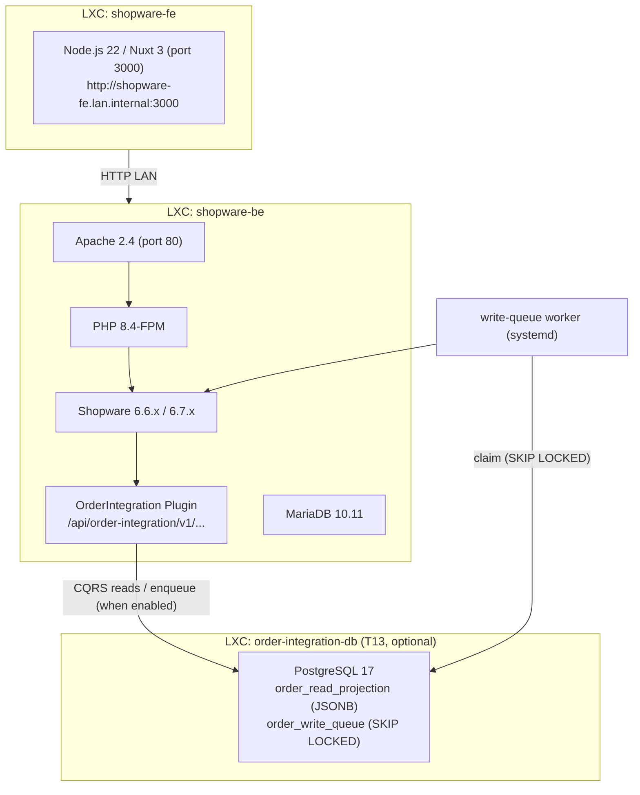

# Order Integration Plugin

[](https://github.com/Scotty42/shopware/actions/workflows/ci.yml)
[](https://github.com/Scotty42/shopware/actions/workflows/e2e-65.yml)
[](https://github.com/Scotty42/shopware/actions/workflows/e2e-66.yml)
[](https://github.com/Scotty42/shopware/actions/workflows/e2e-67.yml)
[](https://codecov.io/gh/Scotty42/shopware)
<br>
[](https://github.com/Scotty42/shopware/actions/workflows/ci.yml)
[](https://github.com/Scotty42/shopware/actions/workflows/ci.yml)
[](https://github.com/Scotty42/shopware/actions/workflows/ci.yml)

Shopware 6 plugin that exposes a domain-shaped, service-to-service REST API for order management. Built as a Shopware-native plugin running inside the Shopware backend container, calling Shopware's internal PHP services directly — no HTTP hop to the Admin API.

---

## Context & motivation

Shopware 6 ships three HTTP API surfaces:

| API | Purpose | Auth | Notes |
|---|---|---|---|
| **Store API** | Storefront: catalog, cart, checkout, customer account | `sw-access-key` header (sales channel key) + `sw-context-token` session | For headless frontends and end users |
| **Admin API** | Full CRUD over all entities, state machine transitions | OAuth 2.0 — client credentials (recommended) or password grant (dev only) | 6.7: scope parameter changed to space-delimited string |
| **Sync API** (`POST /api/_action/sync`) | Bulk create-or-update and delete across any entity in one request | Same OAuth 2.0 as Admin API | Errors returned in response body, not HTTP status codes |

None of these is the right production traffic plane for a D2C ERP/OMS integration at order volume:

- The **Admin API** and **Sync API** share the PHP-FPM pool with the storefront and go through the full Shopware DAL stack on every call — they saturate the shop under sustained order-volume traffic.
- The **Store API** is designed for human-paced storefront interactions and is not appropriate for service-to-service load.

The solution is a **Shopware plugin** that registers its own routes and calls Shopware's internal PHP services (`EntityRepository`, `CartService`, `StateMachineRegistry`, `OrderConverter`) directly — in-process, no HTTP overhead, same DB transaction where needed. See [docs/order-api-concept.md](docs/order-api-concept.md) and [docs/spike-order-creation.md](docs/spike-order-creation.md) for the full design analysis.

---

## Architecture

### Deployment topology

The plugin lives inside the Shopware container. Test scripts read `SHOPWARE_URL`
from `.env.test`, so the target can be local (`http://localhost`) or a
public/staging URL (for example behind Cloudflare Access).

### Plugin location
/var/www/shopware_development/     ← git repo (this repo)
/var/www/shopware/custom/plugins/OrderIntegration → /var/www/shopware_development  (symlink)
/var/www/shopware/                 ← Shopware installation (separate, not in this repo)

### Shopware version compatibility

| Version | Status |
|---|---|
| 6.5.x LTS (EOL Oct 2024) | Supported — CI-verified, no code changes required |
| 6.6.x LTS | Supported (production target) |
| 6.7.x | Supported (development environment) |
| 6.8.x LTS | Planned migration target |

No breaking changes were identified between 6.6.10 and 6.7.x for the services used by this plugin (`CartService`, `OrderPersister`, `OrderConverter`, `StateMachineRegistry`, `MultiFilter`).

### Design invariants

1. **No extra HTTP hop.** The plugin calls Shopware services in-process. Any change that introduces an Admin API call on the hot path breaks the performance model.
2. **Shopware does the pricing.** `CartService` + `OrderConverter` are the only correct path for order creation. Do not implement price/tax logic in the plugin.
3. **CQRS is opt-in.** Both flags default to off. With them off and no `ORDER_INTEGRATION_DB_DSN`, nothing touches Postgres and the plugin behaves synchronously — no new infra needed to run it.
4. **Idempotency lives in the plugin, not in Shopware.** The `IdempotencyService` detects replays before a worker dispatches a command to Shopware. Re-execution against Shopware is avoided at the queue level.
5. **RFC 9457 everywhere.** All error responses must be `application/problem+json` with `type`, `title`, `status`, `detail`, `code`. New endpoints must go through `ExceptionSubscriber`, not return ad-hoc JSON.

---

## Implemented endpoints


### Mutation requirements

Every mutating endpoint (`POST`/`PUT`/`PATCH`/`DELETE`) requires an **`Idempotency-Key`** header:

- Missing → `400` (`order.idempotency_key_required`)
- Same key + same body → original response replayed
- Same key + different body → `409` (`order.idempotency_key_reused`)

`PUT`/`PATCH`/`DELETE` additionally require an **`If-Match`** header with the current `ETag`:

- Missing → `428` (`order.precondition_required`)
- Stale ETag → `412` (`order.precondition_failed`)
- `POST /orders` is exempt — no existing resource to match

Delivery mutations (`PATCH /deliveries/{did}`, `PUT /deliveries/{did}/status`) also require `If-Match`. The delivery `ETag` is returned by `GET /deliveries/{did}`, `POST /deliveries`, and every mutating delivery response.

### Orders

| Method | Path | Description |
|---|---|---|
| `GET` | `/api/order-integration/v1/orders` | List orders (cursor pagination, filters) |
| `POST` | `/api/order-integration/v1/orders` | Create order via CartService + OrderPersister |
| `GET` | `/api/order-integration/v1/orders/{id}` | Get single order |
| `PATCH` | `/api/order-integration/v1/orders/{id}` | Update mutable fields |
| `DELETE` | `/api/order-integration/v1/orders/{id}` | Soft cancel (transitions to `cancelled`) |

### Status transitions

| Method | Path | Description |
|---|---|---|
| `PUT` | `/api/order-integration/v1/orders/{id}/status` | Order state machine (`open → in_progress → completed/cancelled`) |
| `PUT` | `/api/order-integration/v1/orders/{id}/payment-status` | Payment state machine (`open → paid → refunded` etc.) |
| `PUT` | `/api/order-integration/v1/orders/{id}/delivery-status` | Delivery state machine (`open → shipped → returned` etc.) |

### Deliveries (sub-resource)

| Method | Path | Description |
|---|---|---|
| `GET` | `/api/order-integration/v1/orders/{id}/deliveries` | List all deliveries on an order |
| `POST` | `/api/order-integration/v1/orders/{id}/deliveries` | Create additional delivery (split shipment) — returns `ETag` |
| `GET` | `/api/order-integration/v1/orders/{id}/deliveries/{did}` | Get single delivery — returns `ETag` |
| `PATCH` | `/api/order-integration/v1/orders/{id}/deliveries/{did}` | Update tracking codes, shipping method — **requires `If-Match`** |
| `PUT` | `/api/order-integration/v1/orders/{id}/deliveries/{did}/status` | Delivery state transition — **requires `If-Match`** |

### ERP pull-sync

| Method | Path | Description |
|---|---|---|
| `GET` | `/api/order-integration/v1/erp/orders` | Pull queue — orders not yet acknowledged by the ERP (optional `?status=`), FIFO, cursor-paginated |
| `POST` | `/api/order-integration/v1/erp/orders/acknowledge` | Mark a batch (1–500) of orders as forwarded to the ERP (idempotent) |

The acknowledge endpoint writes two optional custom fields per order:

- `customFields.erpSyncedAt` — ISO 8601 timestamp of acknowledgement (always set)
- `customFields.erpOrderId` — your ERP's own order ID (optional; pass an `erpOrderIds` map `{ "<shopwareId>": "<erpId>" }` in the request body)

Both fields are no-migration, filterable via the DAL. See [docs/erp-pull-sync-concept.md](docs/erp-pull-sync-concept.md) for the full design and request/response shapes.

### GET /orders — query parameters

| Parameter | Type | Default | Validation |
|---|---|---|---|
| `limit` | int | 50 | 1–200 |
| `status` | string | — | `open`, `in_progress`, `completed`, `cancelled` |
| `sort` | string | `createdAt:desc` | `(createdAt\|updatedAt\|orderNumber):(asc\|desc)` |
| `customerId` | string | — | 32-char hex **or** canonical UUID, normalized server-side |
| `salesChannelId` | string | — | 32-char hex |
| `createdAfter` | ISO 8601 | — | valid date-time |
| `createdBefore` | ISO 8601 | — | valid date-time |
| `cursor` | string | — | base64-encoded keyset cursor |

Invalid parameters return `422 Unprocessable Content` with RFC 9457 `errors[]` array.

### Response shape

Every order response returns the spec-compliant `Order` payload from `docs/order-api-openapi.yaml`. Mapping lives in `Service/OrderMapper.php`. Key fields:

- `paymentStatus` — last transaction state machine state
- `deliveryStatus` — last delivery state machine state
- `customer`, `billingAddress`, `shippingAddress`, `lineItems`, `deliveries[]` — embedded, no second round trip needed
- `version` — Shopware `versionId`, used to compute the weak `ETag` header

### Error model

All errors use RFC 9457 `application/problem+json` with `type`, `title`, `status`, `detail`, `code`. Validation errors include an `errors[]` array with JSON Pointer references.

Mutation-specific codes: `400 order.idempotency_key_required`, `409 order.idempotency_key_reused`, `428 order.precondition_required`, `412 order.precondition_failed`.

---

## Infrastructure requirements

| Component | Version | Notes |
|---|---|---|
| Debian | Trixie (13) | LXC container on Proxmox |
| PHP | 8.4 | Default in Trixie |
| Apache | 2.4 | `mod_rewrite`, `mod_headers` enabled |
| MariaDB | 10.11 | Default in Trixie |
| Shopware | 6.6.x or 6.7.x | Installed at `/var/www/shopware` |
| Composer | 2.x | For plugin dependency declaration |
| PostgreSQL | 17 | CQRS read projection + write-queue DB — own LXC (`order-integration-db`), Trixie default. Only required when async writes / projection reads are enabled. See [docs/infrastructure-setup.md](docs/infrastructure-setup.md). |

---

## Installation

### Development (symlink)

For working on the plugin, symlink the repo into Shopware so edits are live:

```bash
# 1. Clone next to the Shopware install
git clone git@github.com:Scotty42/shopware.git /var/www/shopware_development

# 2. Symlink into Shopware
ln -s /var/www/shopware_development /var/www/shopware/custom/plugins/OrderIntegration

# 3. Ownership + activate
chown -R www-data:www-data /var/www/shopware/var/
cd /var/www/shopware
./bin/console plugin:refresh
./bin/console plugin:install --activate OrderIntegration
./bin/console cache:clear
```

### Stage / production (packaged plugin)

For a stage or production system, install a versioned **package** instead of a
symlink. Build the zip from the repo:

```bash
bin/build-plugin-zip.sh            # -> OrderIntegration-<version>.zip
# bin/build-plugin-zip.sh v1.0.0 /tmp   # optional: package a specific tag, custom output dir
```

The zip contains a single `OrderIntegration/` folder (composer.json + `src/` +
`LICENSE`); dev-only paths (tests, CI, docs, `.env*`) are excluded via
`.gitattributes` `export-ignore`. It bundles no `vendor/` — the plugin has no
runtime composer dependencies (`shopware/core` is provided by the host).

Install it either way:

**Admin UI** — Extensions → My extensions → *Upload extension* → select the zip →
**Install** → **Activate**.

**CLI:**
```bash
unzip OrderIntegration-<version>.zip -d /var/www/shopware/custom/plugins/
cd /var/www/shopware
chown -R www-data:www-data custom/plugins/OrderIntegration var/
./bin/console plugin:refresh
./bin/console plugin:install --activate OrderIntegration
./bin/console cache:clear
```

> Don't mix the two: remove the dev symlink before installing the packaged
> plugin on the same instance.

---

## Development

### Configuration

Copy `.env.test.dist` to `.env.test` and fill in all values. This file is gitignored and never committed.

```bash
cp .env.test.dist .env.test
```

| Variable | Description |
|---|---|
| `SHOPWARE_URL` | Base URL of the Shopware backend (local, internal, or public test/staging URL) |
| `CF_ACCESS_CLIENT_ID` | Cloudflare Access service token client ID. Required when `SHOPWARE_URL` is behind Cloudflare Access (see note below). |
| `CF_ACCESS_CLIENT_SECRET` | Cloudflare Access service token secret. Required when `SHOPWARE_URL` is behind Cloudflare Access. |
| `SHOPWARE_ADMIN_USER` | Shopware admin username (password grant fallback — use Integration credentials for automated flows) |
| `SHOPWARE_ADMIN_PASSWORD` | Shopware admin password |
| `SHOPWARE_STORE_ACCESS_KEY` | Store API access key of the Headless Sales Channel (starts with `SWSC...`) |
| `SHOPWARE_INTEGRATION_ACCESS_KEY` | `client_id` for the dedicated Shopware Integration (starts with `SWIA...`). Used by `celigo_pull.py` and the Celigo flow. Created in Admin → Settings → System → Integrations. |
| `SHOPWARE_INTEGRATION_SECRET` | `client_secret` for the Integration. Set at creation time, not retrievable afterwards. |
| `SHOPWARE_SALES_CHANNEL_ID` | Hex ID of the Headless Sales Channel used for test order creation |
| `SHOPWARE_TEST_PRODUCT_ID` | Hex ID of an active product used in test orders |

#### Cloudflare Access and WAF

When the `SHOPWARE_URL` is a public endpoint behind **Cloudflare Access**, two
separate CF systems interact with every HTTP client:

**1. Bot Fight Mode (WAF)**
Cloudflare's Bot Fight Mode challenges requests that look non-browser (no JS
execution, non-browser User-Agent, unexpected TLS fingerprint). All test scripts
and iPaaS tools (Celigo, etc.) fall into this category and will receive a
`403` Managed Challenge HTML page.

Fix: in Cloudflare → Security → WAF → Custom Rules, add a **Skip** rule for
the API path:

```text
Field: URI Path / contains / /api/
Action: Skip → Bot Fight Mode
```

**2. Cloudflare Access (Zero Trust)**
CF Access validates a service token on every request, including the OAuth2
token endpoint (`POST /api/oauth/token`). OAuth2 clients (including Celigo's
built-in OAuth2 adaptor) fetch a token before any connection-level headers
are applied, so the token request arrives at CF Access without a service token
and is rejected with `403 Forbidden`.

Fix: in CF Zero Trust → Access → Applications, create a second application
scoped specifically to the token path with a **Bypass** policy:

```text
Domain + path: <your-shopware-host>/api/oauth/token
Policy action: Bypass / Everyone
```

The existing application continues to protect all other paths. After this,
OAuth2 clients can fetch Shopware tokens freely; actual API calls still require
the CF service token headers (`CF-Access-Client-Id`, `CF-Access-Client-Secret`).

Both fixes are required when CF Access and Bot Fight Mode are both active. For
local or VPN-only deployments where CF is not in the path, omit the CF
variables entirely — the scripts detect their absence and skip the headers.

### Run tests

Three suites cover different layers:

**Unit tests (PHPUnit)** — no Shopware kernel required, 289 tests, runs in CI:

```bash
composer install
vendor/bin/phpunit            # full unit suite
composer test:unit            # alias
```


**PDO integration tests** — require a running PostgreSQL instance:

```bash
export ORDER_INTEGRATION_DB_DSN="pgsql:host=localhost;dbname=order_integration;user=order_integration;password=..."
export ORDER_INTEGRATION_DB_USER="order_integration"
export ORDER_INTEGRATION_DB_PASSWORD="..."
psql "$ORDER_INTEGRATION_DB_DSN" -f docs/sql/order_integration_schema.sql
vendor/bin/phpunit --testsuite PdoIntegration
```

Without `ORDER_INTEGRATION_DB_DSN`, PDO integration tests are automatically skipped. See [docs/infrastructure-setup.md](docs/infrastructure-setup.md) for full DB setup.

**HTTP integration tests (Bash)** — requires a live Shopware backend with the plugin installed:

```bash
cp .env.test.dist .env.test   # fill in once
tests/create_test_order.sh    # seed an order
tests/api_test.sh             # run the full HTTP suite
```

### Continuous Integration

GitHub Actions runs two jobs on every PR and push to `main` — see [.github/workflows/ci.yml](.github/workflows/ci.yml):

- **phpunit** — unit tests on PHP 8.2 / 8.3 / 8.4 matrix; Xdebug coverage on 8.3 uploaded to Codecov
- **pdo-integration** — PDO integration tests against a PostgreSQL 17 service container

### After code changes

```bash
cd /var/www/shopware
./bin/console cache:clear
# For DI / service changes:
rm -rf /var/www/shopware/var/cache/*
./bin/console cache:clear
```

---

## Scaling: CQRS read projection + write queue

For production traffic with **parallel writes**, the plugin can run the
load-aware variant (Option C in `docs/order-api-concept.md` §2): a denormalized
**read projection** and a durable **write queue** with a bounded worker pool.

- **Write queue** — `POST /v1/orders` is durably accepted and answered with
  `202 Accepted` + a job URL; a worker pool (`bin/console
  order-integration:write-queue:drain`) applies commands to Shopware with a
  global concurrency cap, exponential-backoff retries, idempotency, and
  backpressure (`503` + `Retry-After`). The queue is claimed with
  `FOR UPDATE SKIP LOCKED`, so several workers drain in parallel without ever
  handing the same command twice — the core guarantee for concurrent access.
- **Read projection** — `GET` reads are served from a Postgres JSONB projection
  kept in sync from Shopware `order.written` / `order.deleted` events, so read
  load never touches the shop DB.

Both paths are **off by default** and gated by env flags
(`ORDER_INTEGRATION_ASYNC_WRITES`, `ORDER_INTEGRATION_PROJECTION_READS`); with
them off and no DSN the plugin keeps its synchronous, DAL-backed behaviour. A
per-request `Prefer: respond-async | respond-sync` header overrides the write
default.

This needs a dedicated fast read/queue database (reference: **PostgreSQL 17** in
its own **Proxmox LXC container** on Debian Trixie, alongside the existing
`shopware-be` / `shopware-fe` containers, one DB for both tables). **Setup — LXC
provisioning, PostgreSQL config, schema, env for testing (`.env.test` /
`.env.test.dist`) and production, and the worker service — is documented in
`docs/infrastructure-setup.md`.** Design rationale is in
`docs/cqrs-write-queue-concept.md`.

### Measured impact (sync vs async CQRS)

A/B benchmark on the BE (`tests/benchmark.py`) measured write p95 −81%, write throughput +443%, and read throughput +191% over the synchronous baseline. Full results and reproduction steps: [docs/benchmark.md](docs/benchmark.md).

---

## License

Licensed under the **PolyForm Noncommercial License 1.0.0** — see `LICENSE`.
Noncommercial use (personal, evaluation, research/education, internal testing,
non-profit) is permitted; **any commercial use requires a separate written
license** from the author. Contact: Dr.-Ing. Markus Friedrich
(markus.friedrich.mobil@gmail.com).

---

## Reference documents

- [docs/order-api-concept.md](docs/order-api-concept.md) — full architecture analysis, Options A/B/C, ERP integration design, security model
- [docs/order-api-openapi.yaml](docs/order-api-openapi.yaml) — OpenAPI 3.1 spec for the full target API surface
- [docs/spike-order-creation.md](docs/spike-order-creation.md) — analysis of four order-creation paths in Shopware 6
- [docs/erp-pull-sync-concept.md](docs/erp-pull-sync-concept.md) — ERP pull queue + acknowledge design (request/response shapes, custom fields, idempotency)
- [docs/benchmark.md](docs/benchmark.md) — A/B load benchmark tool + observed sync-vs-async results
- [docs/release.md](docs/release.md) — versioning, tagging, and the packaging/release workflow
- [docs/cqrs-write-queue-concept.md](docs/cqrs-write-queue-concept.md) — CQRS read projection + write-queue design (Option C / T13)
- [docs/infrastructure-setup.md](docs/infrastructure-setup.md) — read/queue DB LXC, schema, env, and worker setup (T13)


