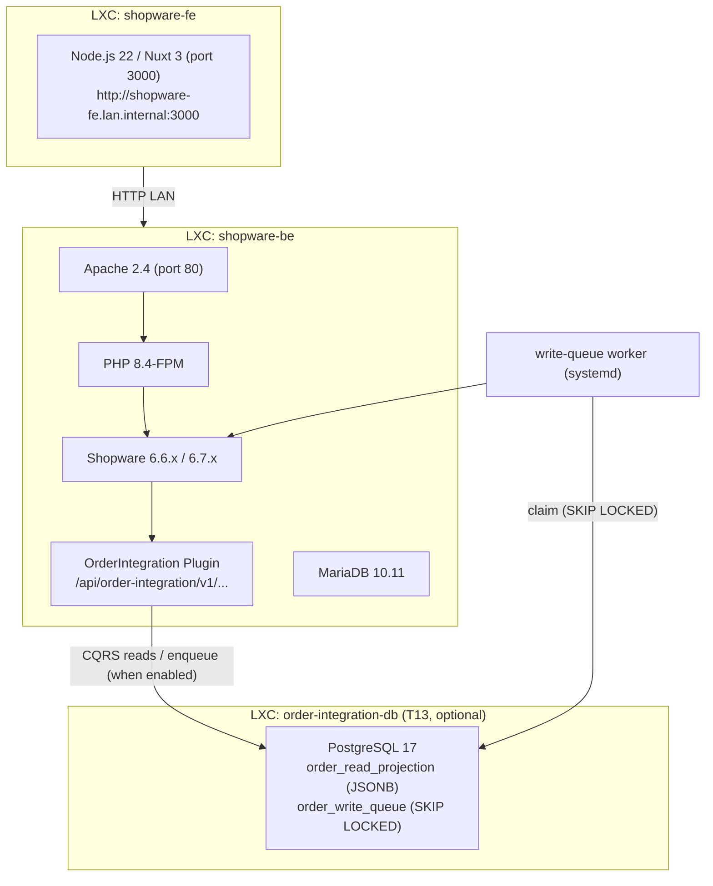

# Order Integration Plugin

Shopware 6 plugin that exposes a domain-shaped, service-to-service REST API for order management. Built as a Shopware-native plugin running inside the Shopware backend container, calling Shopware's internal PHP services directly — no HTTP hop to the Admin API.

---

## Context & motivation

Shopware 6 ships two HTTP APIs:

| API | Purpose | Auth | Suitable for |
|---|---|---|---|
| **Store API** | Storefront-facing: catalog, cart, checkout, customer account | Sales channel access key + `sw-context-token` | Headless frontends, end users |
| **Admin API** | Full CRUD over all entities, state machine transitions | OAuth 2.0 (password grant / client credentials) | Back-office tools, low-volume integrations |

Neither is the right production traffic plane for a D2C integration with an ERP or OMS:

- The **Admin API** runs on the same PHP-FPM pool as the storefront, goes through the full Shopware DAL stack on every call, and will saturate the shop under order-volume read traffic.
- The **Store API** is designed for human-paced storefront traffic and is not appropriate for service-to-service integration load.

The solution is a **Shopware plugin** that registers its own API routes and calls Shopware's internal PHP services (`EntityRepository`, `CartService`, `StateMachineRegistry`, `OrderConverter`) directly — in-process, no HTTP overhead, same DB transaction where needed.

---

## Architecture

### Deployment topology

The plugin lives inside the Shopware container. Test scripts call `http://localhost/...` because they run on the same host. External callers use `http://shopware-be.lan.internal/...`.

### Plugin location
/var/www/shopware_development/     ← git repo (this repo)
/var/www/shopware/custom/plugins/OrderIntegration → /var/www/shopware_development  (symlink)
/var/www/shopware/                 ← Shopware installation (separate, not in this repo)

### Shopware version compatibility

| Version | Status |
|---|---|
| 6.6.x LTS | Supported (production target) |
| 6.7.x | Supported (development environment) |
| 6.8.x LTS | Planned migration target |

No breaking changes were identified between 6.6.10 and 6.7.x for the services used by this plugin (`CartService`, `OrderPersister`, `OrderConverter`, `StateMachineRegistry`, `MultiFilter`).

---

## API design decisions

### Why a plugin instead of a standalone facade

Four options were evaluated (see `docs/order-api-concept.md` and `docs/spike-order-creation.md`):

| Option | Description | Decision |
|---|---|---|
| **A** | Callers hit the Shopware Admin API directly | Rejected — tight coupling, not suitable for D2C load |
| **B** | Standalone facade service in front of the Admin API | Viable for low volume; first step toward Option C |
| **C** | Standalone facade **+ read projection (CQRS) + write queue** (the load-aware variant in `docs/order-api-concept.md` §2) | Built **inside the plugin** in T13 (off by default, env-gated). The infra/load axis on top of Option D — see `docs/cqrs-write-queue-concept.md`. |
| **D** | **Plugin inside Shopware** using internal services (this repo) | **Chosen for the endpoint layer** — lowest latency, no extra hop, uses Shopware's own pricing/checkout code |

> **Note on naming.** Earlier revisions of this README labelled the plugin
> "Option C", which collided with Option C in `docs/order-api-concept.md`
> (the facade + CQRS + queue variant). They are different things: the plugin
> (Option **D**) is the *endpoint* implementation; concept Option **C** is the
> *infra/load* evolution. The two are orthogonal axes and can coexist.

### Route namespace

Shopware reserves `/api/integration/...` for its own integration entity. The plugin uses `/api/order-integration/v1/...` to avoid collision.

### Authentication

Phase 1 uses **Shopware OAuth 2.0** at `/api/oauth/token` (the `shopwareOAuth2` security scheme in `docs/order-api-openapi.yaml`). Two grant types are supported:

**1. Password Grant (development/admin use)**
```bash
curl -X POST /api/oauth/token \
  -d '{"grant_type":"password","client_id":"administration","username":"admin","password":"...","scopes":"write"}'
```

**2. Client Credentials Grant (service-to-service, recommended)**

A dedicated Shopware Integration user is created with limited scope (`admin: false`). Services authenticate with their `accessKey` and `secretAccessKey`:

```bash
curl -X POST /api/oauth/token \
  -d '{"grant_type":"client_credentials","client_id":"<SHOPWARE_INTEGRATION_ACCESS_KEY>","client_secret":"<SHOPWARE_INTEGRATION_SECRET>"}'
```

Plugin routes are registered in the `api` route scope — Shopware validates the Bearer token on every request. No valid token → `401 Unauthorized`.

Phase 5 introduces the dedicated mTLS + OAuth 2.0 client-credentials + API-key set documented in the OpenAPI spec; that auth path runs behind an API gateway and is not implemented in Phase 1.

---

## Implemented endpoints


> **Request requirements on mutations (since backlog T2/T3).** Every mutating
> order endpoint (`POST`/`PUT`/`PATCH`/`DELETE` on `/orders` and the status
> sub-routes) requires an **`Idempotency-Key`** header — missing → `400`
> (`order.idempotency_key_required`), replay of the same key+body returns the
> original response, same key + different body → `409`
> (`order.idempotency_key_reused`). `PUT`/`PATCH`/`DELETE` additionally require
> an **`If-Match`** header carrying the current `ETag` — missing → `428`
> (`order.precondition_required`), stale → `412` (`order.precondition_failed`).
> `POST /orders` needs only `Idempotency-Key` (no resource to match yet). The
> ERP and delivery sub-resources are not yet wired for these headers (follow-up).

### Orders

| Method | Path | Description |
|---|---|---|
| `GET` | `/api/order-integration/v1/orders` | List orders (cursor pagination, filters) |
| `POST` | `/api/order-integration/v1/orders` | Create order via CartService + OrderPersister |
| `GET` | `/api/order-integration/v1/orders/{id}` | Get single order |
| `PATCH` | `/api/order-integration/v1/orders/{id}` | Update mutable fields |
| `DELETE` | `/api/order-integration/v1/orders/{id}` | Soft cancel (transitions to `cancelled`) |

### Status transitions

| Method | Path | Description |
|---|---|---|
| `PUT` | `/api/order-integration/v1/orders/{id}/status` | Order state machine (`open → in_progress → completed/cancelled`) |
| `PUT` | `/api/order-integration/v1/orders/{id}/payment-status` | Payment state machine (`open → paid → refunded` etc.) |
| `PUT` | `/api/order-integration/v1/orders/{id}/delivery-status` | Delivery state machine (`open → shipped → returned` etc.) |

### Deliveries (sub-resource)

| Method | Path | Description |
|---|---|---|
| `GET` | `/api/order-integration/v1/orders/{id}/deliveries` | List all deliveries on an order |
| `POST` | `/api/order-integration/v1/orders/{id}/deliveries` | Create additional delivery (split shipment) |
| `GET` | `/api/order-integration/v1/orders/{id}/deliveries/{did}` | Get single delivery |
| `PATCH` | `/api/order-integration/v1/orders/{id}/deliveries/{did}` | Update tracking codes, shipping method |
| `PUT` | `/api/order-integration/v1/orders/{id}/deliveries/{did}/status` | Delivery state transition |

### ERP pull-sync (T12)

| Method | Path | Description |
|---|---|---|
| `GET` | `/api/order-integration/v1/erp/orders` | Pull queue — orders not yet acknowledged by the ERP (optional `?status=`), FIFO, cursor-paginated |
| `POST` | `/api/order-integration/v1/erp/orders/acknowledge` | Mark a batch (1–500) of orders as forwarded to the ERP; sets `customFields.erpSyncedAt` (idempotent) |

The "known to ERP" flag lives in `order.customFields.erpSyncedAt` (ISO
timestamp) — no migration, filterable via the DAL. See
`docs/erp-pull-sync-concept.md`.

### GET /orders — query parameters

| Parameter | Type | Default | Validation |
|---|---|---|---|
| `limit` | int | 50 | 1–200 |
| `status` | string | — | `open`, `in_progress`, `completed`, `cancelled` |
| `sort` | string | `createdAt:desc` | `(createdAt\|updatedAt\|orderNumber):(asc\|desc)` (T4) |
| `customerId` | string | — | 32-char hex **or** canonical UUID, normalized server-side (T6) |
| `salesChannelId` | string | — | 32-char hex (T5) |
| `createdAfter` | ISO 8601 | — | valid date-time |
| `createdBefore` | ISO 8601 | — | valid date-time |
| `cursor` | string | — | base64-encoded keyset cursor |

Invalid parameters return `422 Unprocessable Content` with RFC 9457 `errors[]` array.

### Response shape

Every order response returns the spec-compliant `Order` payload from `docs/order-api-openapi.yaml`. Mapping lives in `Service/OrderMapper.php`. Key fields:

- `paymentStatus` — last transaction state machine state
- `deliveryStatus` — last delivery state machine state
- `customer`, `billingAddress`, `shippingAddress`, `lineItems`, `deliveries[]` — embedded, no second round trip needed
- `version` — Shopware `versionId`, used to compute the weak `ETag` header

### Error model

All errors use RFC 9457 `application/problem+json` with `type`, `title`, `status`, `detail`, `code`. Validation errors include an `errors[]` array with JSON Pointer references.

Codes added by the cross-cutting backlog items: `400 order.idempotency_key_required`,
`409 order.idempotency_key_reused` (T2), `428 order.precondition_required`,
`412 order.precondition_failed` (T3).

---

## Infrastructure requirements

| Component | Version | Notes |
|---|---|---|
| Debian | Trixie (13) | LXC container on Proxmox |
| PHP | 8.4 | Default in Trixie |
| Apache | 2.4 | `mod_rewrite`, `mod_headers` enabled |
| MariaDB | 10.11 | Default in Trixie |
| Shopware | 6.6.x or 6.7.x | Installed at `/var/www/shopware` |
| Composer | 2.x | For plugin dependency declaration |
| PostgreSQL | 17 | CQRS read projection + write-queue DB — own LXC (`order-integration-db`), Trixie default. Only required when async writes / projection reads are enabled (T13). See `docs/infrastructure-setup.md`. |

---

## Installation

```bash
# 1. Clone into the Shopware container
git clone git@github.com:Scotty42/shopware.git /var/www/shopware_development

# 2. Symlink into Shopware
ln -s /var/www/shopware_development /var/www/shopware/custom/plugins/OrderIntegration

# 3. Set correct ownership
chown -R www-data:www-data /var/www/shopware/var/

# 4. Register and activate plugin
cd /var/www/shopware
./bin/console plugin:refresh
./bin/console plugin:install --activate OrderIntegration
./bin/console cache:clear
```

---

## Development

### Configuration

Copy `.env.test.dist` to `.env.test` and fill in all values. This file is gitignored and never committed.

```bash
cp .env.test.dist .env.test
```

| Variable | Description |
|---|---|
| `SHOPWARE_URL` | Base URL of the Shopware backend (e.g. `http://localhost` on BE container, `http://shopware-be.lan.internal` from other hosts) |
| `SHOPWARE_ADMIN_USER` | Shopware admin username (for password grant token) |
| `SHOPWARE_ADMIN_PASSWORD` | Shopware admin password |
| `SHOPWARE_STORE_ACCESS_KEY` | Store API access key of the Headless Sales Channel (starts with `SWSC...`) |
| `SHOPWARE_INTEGRATION_ACCESS_KEY` | Access key of the dedicated Integration user (starts with `SWIA...`) — created once via Admin API |
| `SHOPWARE_INTEGRATION_SECRET` | Secret of the Integration user — set at creation time, stored hashed in Shopware |
| `SHOPWARE_SALES_CHANNEL_ID` | Hex ID of the Headless Sales Channel used for test order creation |
| `SHOPWARE_TEST_PRODUCT_ID` | Hex ID of an active product used in test orders |

### Run tests

Two suites cover different layers:

**Unit tests (PHPUnit)** — no Shopware kernel required, runs in CI:

```bash
composer install
vendor/bin/phpunit            # full unit suite
composer test:unit            # alias
```

Coverage (pure-logic seams): `QueryValidator`, `StateMachineService`, `OrderMapper`,
`IdempotencyService`, `EtagComparator`, `SoftDeletePolicy`, `OrderCreateValidator`,
`ExceptionSubscriber`, `ErpSyncPolicy`. See `tests/Unit/` and `docs/testing.md` for the full layer breakdown.

**Integration tests (Bash)** — requires a live Shopware backend with the plugin installed:

```bash
cp .env.test.dist .env.test   # fill in once
tests/create_test_order.sh    # seed an order
tests/api_test.sh             # run the full HTTP suite
```

### Continuous Integration

GitHub Actions runs the PHPUnit suite on every PR and on every push to `main` (matrix: PHP 8.2 / 8.3 / 8.4). See `.github/workflows/ci.yml`.

### After code changes

```bash
cd /var/www/shopware
./bin/console cache:clear
# For DI / service changes:
rm -rf /var/www/shopware/var/cache/*
./bin/console cache:clear
```

---

> **Two roadmaps, two axes.** This table tracks **endpoint coverage**. The infra/load axis (sync plugin → read projection → write queue) is tracked in `docs/order-api-concept.md` §2, Option C. README Phase 4 ↔ concept Phase 2 (reads); README Phase 5 ↔ concept Phase 3 (writes) + dedicated auth.

| Phase | Description |
|---|---|
| **1 (done)** | Plugin skeleton, `GET /v1/orders` + `GET /v1/orders/{id}`, cursor pagination, filters, RFC 9457 errors, Shopware OAuth 2.0 (password + client credentials), QueryValidator |
| **2 (done)** | `PUT` status transitions (order, payment, delivery), `POST /v1/orders` via CartService + OrderPersister, OrderMapper, `Location` + `ETag` headers, full spec-compliant `Order` shape |
| **3 (done)** | `PATCH /v1/orders/{id}`, `DELETE /v1/orders/{id}` (soft cancel), Delivery sub-resource (list, get, create-split, patch tracking, status transition) — line-item allocation (`positions`) and richer PATCH fields remain for a follow-up |
| **Hardening (done — backlog T1–T11)** | Idempotency-Key enforcement (T2), If-Match/ETag optimistic concurrency (T3), `sort` (T4) + `salesChannelId` (T5) + `customerId` UUID (T6) on list, soft-delete correctness (T7), POST validation (T8), mapper delivery consistency (T9), delivery 422 problem+json (T10), HTTP/CI test coverage (T11), doc alignment (T1). See `docs/BACKLOG.md`. |
| **ERP pull-sync (done — T12)** | `GET /v1/erp/orders` pull queue + `POST /v1/erp/orders/acknowledge` with the `erpSyncedAt` flag (see `docs/erp-pull-sync-concept.md`). Complements the webhook/`shipment-events` design in §7a, which remains a follow-up. |
| **4 (done — T13)** | Read projection fed by Shopware `order.written`/`order.deleted` events — decouples read traffic from the shop DB (Postgres JSONB; concept §2 Phase 2). Off by default via `ORDER_INTEGRATION_PROJECTION_READS`. |
| **4b** | **ERP webhook path** — outbound `order.created` webhook, inbound batched `POST /shipment-events` for FFP-driven shipment status & tracking (see `docs/order-api-concept.md` §7a) |
| **5 (partial — T13)** | Write queue + bounded async workers (Postgres `SKIP LOCKED`, retry, backpressure; concept §2 Phase 3), off by default via `ORDER_INTEGRATION_ASYNC_WRITES`. Validated end-to-end on the BE and A/B-benchmarked (`docs/benchmark.md`): client-visible write p95 −80%, reads up to +191% throughput; worker count scales drain time ~linearly. Dedicated auth (API key / mTLS), ACL scopes, rate limiting — still open. |

---

## Scaling: CQRS read projection + write queue

For production traffic with **parallel writes**, the plugin can run the
load-aware variant (Option C in `docs/order-api-concept.md` §2): a denormalized
**read projection** and a durable **write queue** with a bounded worker pool.

> **Status:** built and merged (T13), **off by default**. Activated and
> A/B-benchmarked on the BE — see the measured sync-vs-async results in
> `docs/benchmark.md`. Setup (Postgres LXC, schema, env, templated workers) is in
> `docs/infrastructure-setup.md`.

- **Write queue** — `POST /v1/orders` is durably accepted and answered with
  `202 Accepted` + a job URL; a worker pool (`bin/console
  order-integration:write-queue:drain`) applies commands to Shopware with a
  global concurrency cap, exponential-backoff retries, idempotency, and
  backpressure (`503` + `Retry-After`). The queue is claimed with
  `FOR UPDATE SKIP LOCKED`, so several workers drain in parallel without ever
  handing the same command twice — the core guarantee for concurrent access.
- **Read projection** — `GET` reads are served from a Postgres JSONB projection
  kept in sync from Shopware `order.written` / `order.deleted` events, so read
  load never touches the shop DB.

Both paths are **off by default** and gated by env flags
(`ORDER_INTEGRATION_ASYNC_WRITES`, `ORDER_INTEGRATION_PROJECTION_READS`); with
them off and no DSN the plugin keeps its synchronous, DAL-backed behaviour. A
per-request `Prefer: respond-async | respond-sync` header overrides the write
default.

This needs a dedicated fast read/queue database (reference: **PostgreSQL 17** in
its own **Proxmox LXC container** on Debian Trixie, alongside the existing
`shopware-be` / `shopware-fe` containers, one DB for both tables). **Setup — LXC
provisioning, PostgreSQL config, schema, env for testing (`.env.test` /
`.env.test.dist`) and production, and the worker service — is documented in
`docs/infrastructure-setup.md`.** Design rationale is in
`docs/cqrs-write-queue-concept.md`.

---

## Reference documents

- `docs/order-api-concept.md` — full architecture analysis, Options A/B/C, ERP integration design, security model
- `docs/order-api-openapi.yaml` — OpenAPI 3.1 spec for the full target API surface
- `docs/spike-order-creation.md` — analysis of four order-creation paths in Shopware 6
- `docs/erp-pull-sync-concept.md` — ERP pull queue + acknowledge flag design (T12)
- `docs/testing.md` — unit vs. integration test layers and the CI gap
- `docs/BACKLOG.md` — the hardening backlog (T1–T11) with per-task rationale
- `docs/cqrs-write-queue-concept.md` — CQRS read projection + write-queue design (Option C / T13)
- `docs/infrastructure-setup.md` — read/queue DB LXC, schema, env, and worker setup (T13)


